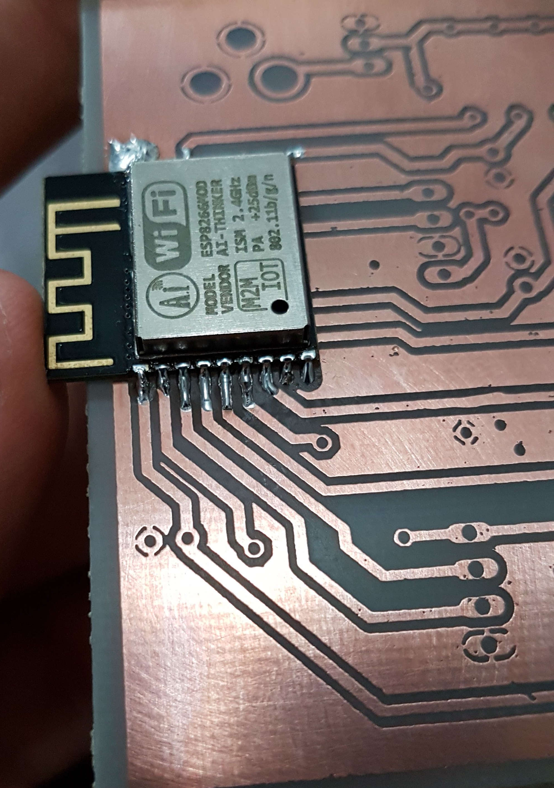

# Coffeere

## Board

This directory contains the [Autodesk's EAGLE](https://www.autodesk.com/products/eagle/overview) project files needed to produce the board.

## Printed Circuit Board

### Board after the layout transference

### Board with ESP8266-12e soldered

